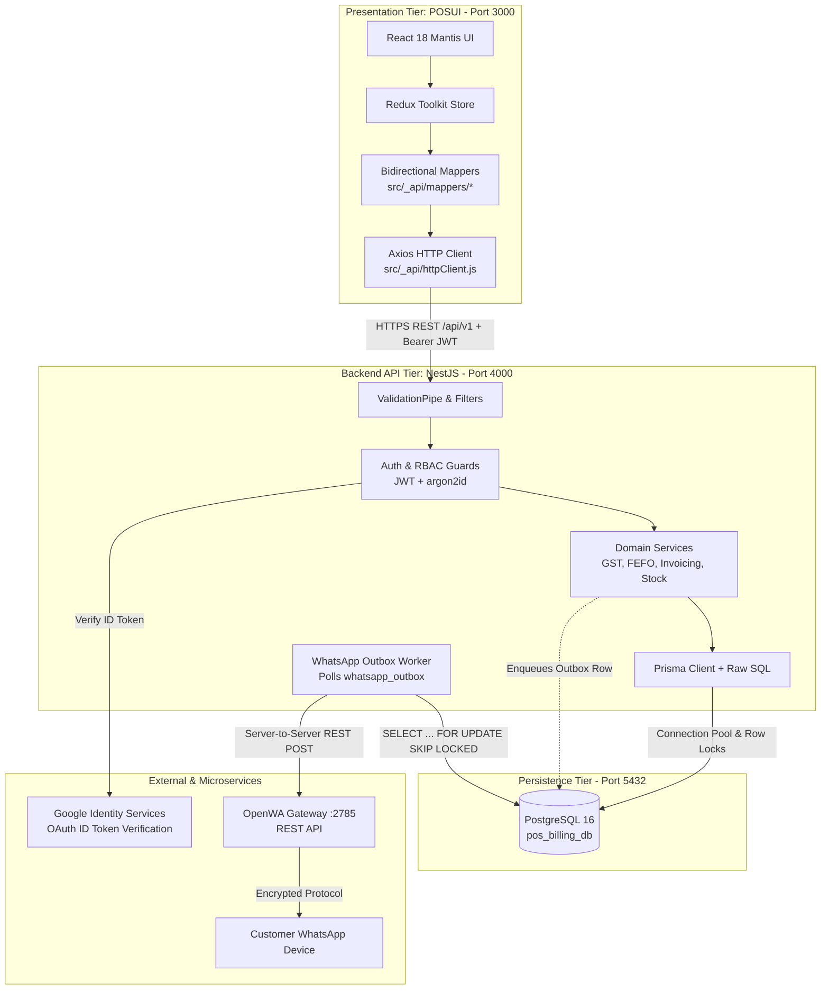

# System Architecture Specification: POS & Billing System

## 1. High-Level Architecture Overview
The POS & Billing System employs a decoupled, multi-tier client-server architecture with a high-performance React Single Page Application (`POSUI`) at the presentation layer, a modular **NestJS** backend REST API (`backend`), **PostgreSQL 16** as the ACID-compliant relational data store with Prisma ORM, and a dedicated **OpenWA** WhatsApp gateway microservice communicating server-to-server via an asynchronous outbox pattern.

---

## 2. Core Architectural Principles & Invariants

### 2.1 Server is the Single Source of Truth
- **Never Trust Client Data:** Product selling prices, tax slabs, GST splits, invoice numbers, stock quantities, and user identities are derived and finalized strictly on the backend.
- The client cart sends item identifiers and requested quantities; `POST /invoices/preview` and `POST /invoices` evaluate actual database rates and calculate all financial figures.
- User identity (`created_by`, `updated_by`) and store scope (`store_id`) are extracted from the verified JWT payload, never from request body parameters.

### 2.2 Financial Arithmetic & Precision (`decimal.js`)
- JavaScript IEEE 754 floating-point arithmetic is strictly prohibited for financial operations.
- All pricing, tax rates, line calculations, round-offs, and ledger sums are calculated using `decimal.js`.
- Database storage utilizes `numeric(14,2)` for monetary values, `numeric(5,2)` for tax percentages, and `numeric(14,3)` for item quantities (supporting fractional weights).

### 2.3 Atomicity, Transactions & Concurrency Control
Multi-table writes always execute within a single PostgreSQL transaction (`prisma.$transaction` or explicit `BEGIN ... COMMIT`):
1. **Invoice Creation (`POST /invoices`):**
   - Batches locked and allocated using First-Expiry, First-Out (**FEFO**) via `SELECT ... FOR UPDATE`.
   - Sequential gapless invoice numbering locked via `SELECT ... FOR UPDATE` on `invoice_number_sequences`.
   - Atomically decrements `stock_batches`, writes `stock_ledger` `SALE` rows, inserts `invoices`, `invoice_items`, `payments`, and enqueues a `whatsapp_outbox` record.
2. **Invoice Cancellation (`POST /invoices/:id/cancel`):**
   - Locks invoice row, updates status to `CANCELLED`, restores allocated batch quantities, appends `SALE_CANCEL` rows to `stock_ledger`, and flags payment as `REFUNDED`.
   - Invoice numbers are permanently retired and never reused.

### 2.4 Transactional WhatsApp Outbox Pattern
- The browser never communicates with OpenWA directly.
- The backend writes receipt payloads to `whatsapp_outbox` inside the invoice transaction.
- An independent background worker polls pending records using `FOR UPDATE SKIP LOCKED` and transmits them to OpenWA with exponential backoff (up to 5 attempts).
- **Failure Isolation:** An unreachable OpenWA gateway or failed delivery will **never** fail or roll back the invoice creation transaction.

### 2.5 Role-Based Access Control (RBAC) & Stakeholders
- Only three authenticated login roles exist:
  1. **`ADMIN`:** Full access across all modules and settings.
  2. **`CASHIER`:** Restricted to POS Billing, Invoicing (view/create own), Customers (view/create), and Product catalog viewing.
  3. **`INVENTORY_MANAGER`:** Access to Products, Categories, Vendors, Purchase Orders, Material Inward, Material Returns, Stock ledger, and Stock reports.
- **External Entity:** `VENDOR` is an external supplier with **no system login or user account**.
- Route guards enforce permissions via `@RequirePermission(module, action)` on every endpoint.

---

## 3. Frontend Integration & Compatibility Architecture
To eliminate risks of UI regressions, the React frontend (`POSUI`) preserves its existing structure:
1. **Function Signature Preservation:** Every function in `POSUI/src/_api/*` retains its exact name, arguments, and return interface.
2. **HTTP Client (`src/_api/httpClient.js`):** Replaces Firestore SDK with an Axios instance pointing to `REACT_APP_API_URL` (`/api/v1`).
   - Access token stored in memory only.
   - HTTP response interceptor automatically handles 401 token expiration by invoking `POST /auth/refresh` once, queuing concurrent calls, and retrying.
   - Attaches `Idempotency-Key` UUID on invoice creation requests.
3. **Bidirectional Mappers (`src/_api/mappers/*`):** Transparently convert backend `camelCase` DTOs to the legacy `PascalCase` format expected by MUI tables and Formik forms (`Id`, `Name`, `ProductNumber`, `RecordStatus`, etc.).

---

## 4. State Management (Redux Toolkit)
- **`authSlice`:** Manages user identity, session state, permissions matrix, and assigned store IDs.
- **`cartSlice`:** Manages active terminal cart, line items, customer association, and payment tenders.
- **`heldBucketsSlice`:** Manages multi-queue held baskets (`BKT-01`, `BKT-02`) synced with backend buckets API.
- **`masterDataSlice`:** Caches active categories, stores, and tax rates for rapid rendering.
