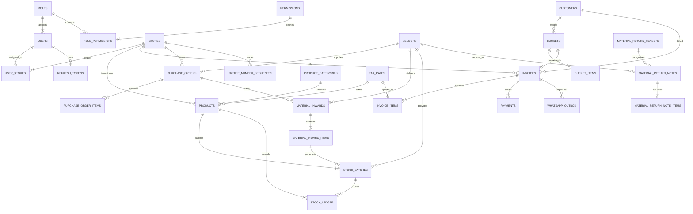

# PostgreSQL Database Schema Specification: POS & Billing System

## 1. Global Conventions & Design Invariants

Every table in the PostgreSQL database adheres to strict enterprise relational conventions:

| Standard | Rule / Specification |
| :--- | :--- |
| **Primary Keys** | `id uuid PRIMARY KEY DEFAULT gen_random_uuid()` |
| **Audit Timestamps** | `created_at timestamptz NOT NULL DEFAULT now()`, `updated_at timestamptz NOT NULL DEFAULT now()` (maintained via PostgreSQL trigger) |
| **Audit User IDs** | `created_by uuid NULL REFERENCES users(id) ON DELETE RESTRICT`, `updated_by uuid NULL REFERENCES users(id) ON DELETE RESTRICT` |
| **Soft Delete** | `record_status smallint NOT NULL DEFAULT 0 CHECK (record_status IN (0,1))` on master tables (`0 = Active`, `1 = Deleted/Cancelled`). Accompanied by **partial indexes** `WHERE record_status = 0`. |
| **Monetary Types** | `numeric(14,2)` for currency values. Never use `float` or `double precision`. |
| **Rate / Percentage** | `numeric(5,2)` for GST tax percentages and profit margins. |
| **Quantity Types** | `numeric(14,3)` for stock quantities and weights (supporting fractional metric units like kilograms/liters). |
| **Temporal Types** | `timestamptz` for system events; `date` for business dates (invoice date, shelf-life expiry date). Business timezone: `Asia/Kolkata`. |
| **Naming Conventions** | Plural `snake_case` for table names; `snake_case` for columns. Prisma schema maps to camelCase models. |
| **Referential Integrity**| `ON DELETE RESTRICT` on all foreign keys. Every FK column is explicitly indexed. |
| **Check Constraints** | Quantities `> 0`, amounts `>= 0`, tax rate invariant `igst = cgst + sgst`, batch expiry `expiry_date >= inward date`. |
| **Legacy Compatibility**| Nullable `legacy_firestore_id text UNIQUE` on master tables for data migration verification. |

---

## 2. Entity Relationship Model



---

## 3. Table Schema Definitions

### 3.1 Security & Access Control

#### `roles`
Stores core system roles. Seeded with `ADMIN`, `CASHIER`, `INVENTORY_MANAGER`.
- `id` (uuid, PK)
- `name` (varchar(32), UNIQUE) - CHECK (`name IN ('ADMIN', 'CASHIER', 'INVENTORY_MANAGER')`)
- `description` (text, nullable)
- Audit columns (`created_at`, `updated_at`)

#### `permissions`
Master list of granular system permissions across modules and actions.
- `id` (uuid, PK)
- `module` (varchar(64), NOT NULL) - e.g., `BILLING`, `PRODUCTS`, `INVOICES`
- `action` (varchar(32), NOT NULL) - CHECK (`action IN ('VIEW', 'CREATE', 'EDIT', 'DELETE', 'EXPORT', 'APPROVE')`)
- `created_at` (timestamptz, DEFAULT now())
- UNIQUE (`module`, `action`)

#### `role_permissions`
Composite junction table binding permissions to roles.
- `role_id` (uuid, FK `roles(id)` ON DELETE RESTRICT)
- `permission_id` (uuid, FK `permissions(id)` ON DELETE RESTRICT)
- PK (`role_id`, `permission_id`)

#### `users`
Authenticated staff user accounts.
- `id` (uuid, PK)
- `name` (varchar(255), NOT NULL)
- `email` (citext, UNIQUE NOT NULL)
- `password_hash` (varchar(255), nullable for Google-only users)
- `google_sub` (varchar(255), UNIQUE nullable)
- `role_id` (uuid, FK `roles(id)` ON DELETE RESTRICT)
- `is_active` (boolean, DEFAULT true)
- `failed_login_count` (int, DEFAULT 0)
- `locked_until` (timestamptz, nullable)
- `last_login_at` (timestamptz, nullable)
- Audit columns (`created_at`, `updated_at`, `created_by`, `updated_by`)

#### `user_stores`
Junction table defining store branches accessible to a user.
- `user_id` (uuid, FK `users(id)` ON DELETE RESTRICT)
- `store_id` (uuid, FK `stores(id)` ON DELETE RESTRICT)
- PK (`user_id`, `store_id`)

#### `refresh_tokens`
Cryptographically hashed refresh token storage supporting automatic rotation and reuse detection.
- `id` (uuid, PK)
- `user_id` (uuid, FK `users(id)` ON DELETE RESTRICT)
- `token_hash` (varchar(255), NOT NULL) - SHA-256 hash of the token
- `expires_at` (timestamptz, NOT NULL)
- `revoked_at` (timestamptz, nullable)
- `replaced_by` (uuid, nullable)
- `ip_address` (inet, nullable)
- `user_agent` (text, nullable)
- `created_at` (timestamptz, DEFAULT now())
- INDEX (`user_id`), INDEX (`token_hash`)

---

### 3.2 Master Data

#### `stores`
Store branches, retail outlets, or central warehouses.
- `id` (uuid, PK)
- `name` (varchar(255), NOT NULL) - Brand name
- `long_name` (varchar(255), nullable) - Registered legal entity name
- `address` (text, NOT NULL)
- `mobile_number` (varchar(32), NOT NULL)
- `phone_number` (varchar(32), nullable)
- `email` (varchar(255), NOT NULL)
- `food_license_number` (varchar(64), nullable) - FSSAI license
- `gst_number` (varchar(15), nullable) - CHECK (`gst_number ~ '^[0-9]{2}[A-Z]{5}[0-9]{4}[A-Z]{1}[1-9A-Z]{1}Z[0-9A-Z]{1}$'`)
- `country` (varchar(64), DEFAULT 'India')
- `state` (varchar(64), NOT NULL)
- `state_code` (varchar(2), NOT NULL) - 2-digit GST state code (e.g., '27' for Maharashtra)
- `invoice_prefix` (varchar(16), DEFAULT 'INV')
- `receipt_footer_text` (text, nullable)
- `paper_size` (varchar(16), DEFAULT '80mm') - '58mm', '80mm', 'A4'
- `enable_whatsapp_receipt` (boolean, DEFAULT true)
- `record_status` (smallint, DEFAULT 0)
- Audit columns (`created_at`, `updated_at`, `created_by`, `updated_by`)

#### `product_categories`
Product classification categories.
- `id` (uuid, PK)
- `name` (varchar(255), NOT NULL)
- `record_status` (smallint, DEFAULT 0)
- Audit columns (`created_at`, `updated_at`, `created_by`, `updated_by`)
- UNIQUE (`name`, `record_status`) WHERE `record_status = 0`

#### `tax_rates`
GST tax slabs.
- `id` (uuid, PK)
- `name` (varchar(255), NOT NULL) - e.g., "GST 18%"
- `igst` (numeric(5,2), NOT NULL DEFAULT 0.00)
- `cgst` (numeric(5,2), NOT NULL DEFAULT 0.00)
- `sgst` (numeric(5,2), NOT NULL DEFAULT 0.00)
- `record_status` (smallint, DEFAULT 0)
- Audit columns (`created_at`, `updated_at`, `created_by`, `updated_by`)
- CHECK (`igst = cgst + sgst`)

#### `products`
Master product catalog.
- `id` (uuid, PK)
- `product_number` (integer, UNIQUE NOT NULL) - Auto-incrementing business barcode prefix
- `name` (varchar(255), NOT NULL)
- `cost` (numeric(14,2), NOT NULL CHECK (cost >= 0)) - Selling price at POS per PRD
- `ingredients` (text, nullable)
- `notes` (text, nullable)
- `is_exp_date` (boolean, DEFAULT false)
- `days` (integer, nullable) - Shelf-life days (required if `is_exp_date = true`)
- `category_id` (uuid, FK `product_categories(id)` ON DELETE RESTRICT)
- `tax_rate_id` (uuid, FK `tax_rates(id)` ON DELETE RESTRICT)
- `hsn_code` (varchar(16), nullable)
- `record_status` (smallint, DEFAULT 0)
- Audit columns (`created_at`, `updated_at`, `created_by`, `updated_by`)
- GIN trigram index on `name` (`CREATE INDEX idx_products_name_trgm ON products USING gin (name gin_trgm_ops)`)

#### `vendors`
External goods suppliers (no system login).
- `id` (uuid, PK)
- `vendor_code` (integer, UNIQUE NOT NULL)
- `name` (varchar(255), NOT NULL)
- `address` (text, nullable)
- `city` (varchar(128), nullable)
- `pin` (varchar(16), nullable)
- `email` (varchar(255), nullable)
- `mobile_number` (varchar(32), nullable)
- `note` (text, nullable)
- `record_status` (smallint, DEFAULT 0)
- Audit columns (`created_at`, `updated_at`, `created_by`, `updated_by`)

#### `customers`
Retail and B2B customers.
- `id` (uuid, PK)
- `name` (varchar(255), NOT NULL)
- `mobile_number` (varchar(32), NOT NULL) - Normalized 10-digit format
- `gst_number` (varchar(15), nullable)
- `country` (varchar(64), DEFAULT 'India')
- `state` (varchar(64), DEFAULT 'Maharashtra')
- `state_code` (varchar(2), DEFAULT '27')
- `record_status` (smallint, DEFAULT 0)
- Audit columns (`created_at`, `updated_at`, `created_by`, `updated_by`)
- Partial UNIQUE (`mobile_number`) WHERE `record_status = 0`

#### `material_return_reasons`
Predefined return reasons for vendor debit notes.
- `id` (uuid, PK)
- `name` (varchar(255), NOT NULL)
- `record_status` (smallint, DEFAULT 0)
- Audit columns (`created_at`, `updated_at`)

#### `settings`
System and per-store configuration key-value storage.
- `id` (uuid, PK)
- `store_id` (uuid, nullable, FK `stores(id)` ON DELETE RESTRICT)
- `key` (varchar(128), NOT NULL)
- `input_type` (varchar(32), NOT NULL) - 'STRING', 'NUMBER', 'BOOLEAN', 'JSON'
- `value` (jsonb, NOT NULL)
- Audit columns (`created_at`, `updated_at`, `updated_by`)
- UNIQUE (`store_id`, `key`)

---

### 3.3 Purchasing & Stock Management

#### `purchase_orders` & `purchase_order_items`
Header and line items for supplier purchase orders.
- `purchase_orders`: `id`, `document_number` (UNIQUE per store), `date` (date), `vendor_id` (FK `vendors`), `store_id` (FK `stores`), `status` (varchar(32) CHECK in ('DRAFT','SENT','PARTIALLY_RECEIVED','RECEIVED','CANCELLED')), `total_amount` (numeric(14,2)), `record_status`, audit columns.
- `purchase_order_items`: `id`, `purchase_order_id` (FK `purchase_orders`), `product_id` (FK `products`), `quantity` (numeric(14,3) CHECK > 0), `rate` (numeric(14,2) CHECK >= 0), `delivery_date` (date), `received_quantity` (numeric(14,3) DEFAULT 0), audit columns.

#### `material_inwards` & `material_inward_items`
Header and line items for inward goods receipts (with or without PO).
- `material_inwards`: `id`, `purchase_order_id` (nullable FK), `vendor_id` (FK `vendors`), `store_id` (FK `stores`), `date` (timestamptz DEFAULT now()), `is_po_available` (boolean), `record_status`, audit columns.
- `material_inward_items`: `id`, `inward_id` (FK `material_inwards`), `product_id` (FK `products`), `quantity` (numeric(14,3) CHECK > 0), `rate` (numeric(14,2) CHECK >= 0), `expiry_date` (date, nullable), audit columns.

#### `stock_batches`
Physical inventory batches created during material inward. Supports First-Expiry, First-Out (**FEFO**).
- `id` (uuid, PK)
- `inward_item_id` (uuid, FK `material_inward_items(id)` ON DELETE RESTRICT)
- `product_id` (uuid, FK `products(id)` ON DELETE RESTRICT)
- `vendor_id` (uuid, FK `vendors(id)` ON DELETE RESTRICT)
- `store_id` (uuid, FK `stores(id)` ON DELETE RESTRICT)
- `barcode` (varchar(64), UNIQUE NOT NULL) - 13-digit scannable thermal barcode
- `received_date` (date NOT NULL)
- `expiry_date` (date, nullable)
- `quantity_received` (numeric(14,3) NOT NULL CHECK (quantity_received > 0))
- `quantity_available` (numeric(14,3) NOT NULL CHECK (quantity_available >= 0))
- `rate` (numeric(14,2) NOT NULL)
- `record_status` (smallint DEFAULT 0)
- Audit columns (`created_at`, `updated_at`)
- INDEX (`product_id`, `store_id`, `expiry_date`) WHERE `quantity_available > 0`

#### `stock_ledger`
Append-only immutable audit ledger of all inventory movements.
- `id` (uuid, PK)
- `product_id` (uuid, FK `products(id)` ON DELETE RESTRICT)
- `batch_id` (uuid, FK `stock_batches(id)` ON DELETE RESTRICT)
- `store_id` (uuid, FK `stores(id)` ON DELETE RESTRICT)
- `movement_type` (varchar(32) NOT NULL CHECK in ('INWARD', 'SALE', 'SALE_CANCEL', 'VENDOR_RETURN', 'ADJUSTMENT'))
- `quantity_delta` (numeric(14,3) NOT NULL) - Signed delta (+qty for inward/cancel, -qty for sale/return)
- `ref_type` (varchar(32) NOT NULL) - 'INWARD', 'INVOICE', 'RETURN_NOTE', 'ADJUSTMENT'
- `ref_id` (uuid NOT NULL)
- `created_by` (uuid, FK `users(id)`)
- `created_at` (timestamptz DEFAULT now())
- INDEX (`product_id`, `store_id`, `created_at`)
- **Trigger Enforced:** Any `UPDATE` or `DELETE` statement executed against `stock_ledger` raises an immediate SQL exception.

#### `material_return_notes` & `material_return_note_items`
Vendor returns and debit note itemization.
- `material_return_notes`: `id`, `document_number` (UNIQUE per store), `vendor_id` (FK `vendors`), `store_id` (FK `stores`), `date` (date), `reason_id` (FK `material_return_reasons`), `total_amount` (numeric(14,2)), `record_status`, audit columns.
- `material_return_note_items`: `id`, `return_note_id` (FK `material_return_notes`), `product_id` (FK `products`), `batch_id` (FK `stock_batches`), `quantity` (numeric(14,3) CHECK > 0), `rate` (numeric(14,2)), audit columns.

---

### 3.4 Sales & Billing

#### `buckets` & `bucket_items`
POS cart holding queues (`BKT-01`, `BKT-02`).
- `buckets`: `id`, `bucket_number` (varchar(32) NOT NULL), `customer_id` (nullable FK `customers`), `mobile_number` (varchar(32), nullable), `date` (timestamptz DEFAULT now()), `status` (varchar(32) CHECK in ('OPEN', 'HELD', 'CONVERTED', 'CLEARED')), `store_id` (FK `stores`), `cashier_id` (FK `users`), `record_status`, audit columns.
- `bucket_items`: `id`, `bucket_id` (FK `buckets`), `product_id` (FK `products`), `batch_id` (nullable FK `stock_batches`), `quantity` (numeric(14,3) CHECK > 0), `rate` (numeric(14,2)), `amount` (numeric(14,2)), audit columns.

#### `invoice_number_sequences`
Atomic table holding the current sequential number for each store per Indian financial year.
- `store_id` (uuid, FK `stores(id)` ON DELETE RESTRICT)
- `financial_year` (varchar(8) NOT NULL) - e.g., '2026-27'
- `last_number` (integer NOT NULL DEFAULT 0)
- PK (`store_id`, `financial_year`)

#### `invoices`
Finalized, immutable GST tax invoices.
- `id` (uuid, PK)
- `document_number` (varchar(64) NOT NULL) - Formatted: `INV/2026-27/MUM01/000101`
- `financial_year` (varchar(8) NOT NULL)
- `date` (timestamptz DEFAULT now())
- `store_id` (uuid, FK `stores(id)` ON DELETE RESTRICT)
- `customer_id` (uuid, nullable FK `customers(id)` ON DELETE RESTRICT)
- `bucket_id` (uuid, nullable FK `buckets(id)` ON DELETE RESTRICT)
- `mobile_number` (varchar(32), nullable)
- `mode_of_payment` (smallint NOT NULL CHECK (mode_of_payment IN (0, 1))) - `0 = Cash`, `1 = UPI/Card`
- `is_payment_received` (boolean DEFAULT true)
- `is_share_receipt_through_sms` (boolean DEFAULT false)
- `subtotal` (numeric(14,2) NOT NULL CHECK (subtotal >= 0))
- `total_cgst` (numeric(14,2) NOT NULL DEFAULT 0.00)
- `total_sgst` (numeric(14,2) NOT NULL DEFAULT 0.00)
- `total_igst` (numeric(14,2) NOT NULL DEFAULT 0.00)
- `round_off` (numeric(8,2) NOT NULL DEFAULT 0.00)
- `amount` (numeric(14,2) NOT NULL CHECK (amount >= 0)) - Grand total payable
- `status` (varchar(32) DEFAULT 'ACTIVE' CHECK (status IN ('ACTIVE', 'CANCELLED')))
- `cancel_reason` (text, nullable)
- `cancelled_at` (timestamptz, nullable)
- `cancelled_by` (uuid, nullable FK `users(id)`)
- `idempotency_key` (uuid, UNIQUE NOT NULL)
- `record_status` (smallint DEFAULT 0)
- Audit columns (`created_at`, `updated_at`, `created_by`, `updated_by`)
- UNIQUE (`store_id`, `financial_year`, `document_number`)
- INDEX (`store_id`, `date` DESC), INDEX (`customer_id`), INDEX (`status`)

#### `invoice_items`
Immutable historical snapshot of invoice line items.
- `id` (uuid, PK)
- `invoice_id` (uuid, FK `invoices(id)` ON DELETE RESTRICT)
- `product_id` (uuid, FK `products(id)` ON DELETE RESTRICT)
- `product_name` (varchar(255) NOT NULL) - Snapshot
- `hsn_code` (varchar(16), nullable) - Snapshot
- `batch_id` (uuid, FK `stock_batches(id)` ON DELETE RESTRICT)
- `quantity` (numeric(14,3) NOT NULL CHECK (quantity > 0))
- `rate` (numeric(14,2) NOT NULL CHECK (rate >= 0))
- `taxable_value` (numeric(14,2) NOT NULL CHECK (taxable_value >= 0))
- `tax_rate_id` (uuid, FK `tax_rates(id)` ON DELETE RESTRICT)
- `cgst_rate` (numeric(5,2) NOT NULL DEFAULT 0.00)
- `sgst_rate` (numeric(5,2) NOT NULL DEFAULT 0.00)
- `igst_rate` (numeric(5,2) NOT NULL DEFAULT 0.00)
- `cgst` (numeric(14,2) NOT NULL DEFAULT 0.00)
- `sgst` (numeric(14,2) NOT NULL DEFAULT 0.00)
- `igst` (numeric(14,2) NOT NULL DEFAULT 0.00)
- `line_total` (numeric(14,2) NOT NULL CHECK (line_total >= 0))
- Audit columns (`created_at`)
- INDEX (`invoice_id`), INDEX (`product_id`)

#### `payments`
Tender settlement records.
- `id` (uuid, PK)
- `invoice_id` (uuid, FK `invoices(id)` ON DELETE RESTRICT)
- `mode` (smallint NOT NULL CHECK (mode IN (0, 1)))
- `amount` (numeric(14,2) NOT NULL CHECK (amount >= 0))
- `status` (varchar(32) DEFAULT 'RECEIVED' CHECK (status IN ('PENDING', 'RECEIVED', 'REFUNDED')))
- `reference` (varchar(128), nullable) - UPI transaction ID or tender note
- `received_at` (timestamptz DEFAULT now())
- Audit columns (`created_at`, `updated_at`)

---

### 3.5 Platform & Operations

#### `whatsapp_outbox`
Transactional outbox queue for WhatsApp receipt dispatches.
- `id` (uuid, PK)
- `invoice_id` (uuid, FK `invoices(id)` ON DELETE RESTRICT)
- `mobile_number` (varchar(32) NOT NULL)
- `payload` (jsonb NOT NULL) - Formatted text receipt and metadata
- `status` (varchar(32) DEFAULT 'PENDING' CHECK (status IN ('PENDING', 'SENT', 'FAILED')))
- `attempts` (smallint DEFAULT 0)
- `last_error` (text, nullable)
- `next_attempt_at` (timestamptz DEFAULT now())
- Audit columns (`created_at`, `updated_at`)
- INDEX (`status`, `next_attempt_at`) WHERE `status = 'PENDING'`

#### `audit_logs`
System-wide audit trail for sensitive administrative and financial operations.
- `id` (uuid, PK)
- `actor_id` (uuid, nullable FK `users(id)`)
- `action` (varchar(64) NOT NULL) - e.g., 'AUTH_LOGIN', 'INVOICE_CANCEL', 'STOCK_ADJUSTMENT'
- `entity` (varchar(64) NOT NULL) - e.g., 'invoices', 'users', 'settings'
- `entity_id` (uuid, NOT NULL)
- `before` (jsonb, nullable)
- `after` (jsonb, nullable)
- `ip_address` (inet, nullable)
- `created_at` (timestamptz DEFAULT now())
- INDEX (`entity`, `entity_id`, `created_at`)

#### `idempotency_keys`
Prevents double-submission on API endpoints.
- `id` (uuid, PK)
- `key` (uuid, UNIQUE NOT NULL)
- `endpoint` (varchar(255) NOT NULL)
- `response_status` (integer NOT NULL)
- `response_body` (jsonb NOT NULL)
- `created_at` (timestamptz DEFAULT now())
- INDEX (`key`, `created_at`)

---

## 4. Database Triggers & Stored Procedures

### 4.1 Automated `updated_at` Trigger
```sql
CREATE OR REPLACE FUNCTION update_timestamp_column()
RETURNS TRIGGER AS $$
BEGIN
    NEW.updated_at = NOW();
    RETURN NEW;
END;
$$ LANGUAGE plpgsql;
```
Applied to: `stores`, `product_categories`, `tax_rates`, `products`, `vendors`, `customers`, `settings`, `users`, `purchase_orders`, `stock_batches`, `invoices`, `payments`, `whatsapp_outbox`.

### 4.2 Append-Only Protection for `stock_ledger`
```sql
CREATE OR REPLACE FUNCTION prevent_stock_ledger_mutation()
RETURNS TRIGGER AS $$
BEGIN
    RAISE EXCEPTION 'Direct UPDATE or DELETE operations on stock_ledger are strictly prohibited for audit integrity.';
END;
$$ LANGUAGE plpgsql;

CREATE TRIGGER trg_stock_ledger_immutable
BEFORE UPDATE OR DELETE ON stock_ledger
FOR EACH ROW EXECUTE FUNCTION prevent_stock_ledger_mutation();
```

---

## 5. Migration Down-Path Notes
All schema migrations are forward-applied using `prisma migrate deploy`. In the event of emergency rollbacks during deployment staging:
- **Migration 001 (Core Security & Masters):** Down-path executes `DROP TABLE IF EXISTS refresh_tokens, user_stores, users, role_permissions, permissions, roles, settings, material_return_reasons, customers, vendors, products, tax_rates, product_categories, stores CASCADE;`
- **Migration 002 (Inventory & Purchasing):** Down-path executes `DROP TABLE IF EXISTS material_return_note_items, material_return_notes, stock_ledger, stock_batches, material_inward_items, material_inwards, purchase_order_items, purchase_orders CASCADE;`
- **Migration 003 (Invoicing & Platform):** Down-path executes `DROP TABLE IF EXISTS audit_logs, whatsapp_outbox, idempotency_keys, payments, invoice_items, invoices, invoice_number_sequences, bucket_items, buckets CASCADE;`
