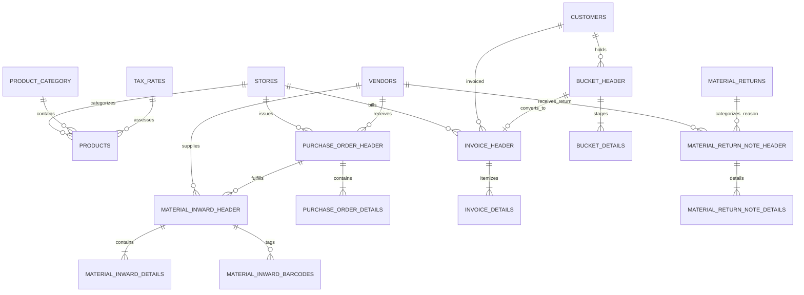

# Firestore Database Schema Specification: POS & Billing System

## 1. Overview and Global Audit Conventions
Every document across all Cloud Firestore collections MUST include the standardized six global audit attributes. Soft deletion is mandatory throughout the entire schema; records are NEVER hard deleted.

### Global Document Headers
| Attribute | Type | Description / Constraints |
| :--- | :--- | :--- |
| `Id` | `string` | Unique Document Identifier (matches Firestore document key). |
| `Created` | `timestamp` | UTC server timestamp of record creation (`serverTimestamp()`). |
| `Updated` | `timestamp` | UTC server timestamp of most recent update (`serverTimestamp()`). |
| `RecordStatus` | `number` | Soft delete status flag: **`0` = Active (Visible)**, **`1` = Deleted / Cancelled (Hidden)**. |
| `CreatedId` | `string` | Firebase Auth UID of the actor creating the document. |
| `UpdatedId` | `string` | Firebase Auth UID of the actor modifying the document. |

---

## 2. Entity Relationship Model



---

## 3. Detailed Collection Specifications

### 3.1 `Stores`
Stores represent physical retail retail branches, cafes, or supermarkets.
- **Path:** `/Stores/{storeId}`
- **Fields:**
  - `Id` (string, required): Document ID.
  - `Name` (string, required): Brand display name (e.g., "DailyMart Express").
  - `LongName` (string, optional): Registered legal entity name.
  - `Address` (string, required): Street address.
  - `MobileNumber` (string, required): Primary operational phone.
  - `PhoneNumber` (string, optional): Landline telephone number.
  - `Email` (string, required): Store contact email.
  - `FoodLicenseNumber` (string, optional): FSSAI license (mandatory for food/cafe outlets).
  - `GstNumber` (string, optional): 15-character Indian GSTIN (e.g., `27AABCU9603R1ZM`).
  - `Country` (string, required, default: "India"): Country name.
  - `State` (string, required): State name or code (used for GST intra/inter determination, e.g., "Maharashtra").
  - Global audit fields (`Created`, `Updated`, `RecordStatus`, `CreatedId`, `UpdatedId`).

### 3.2 `ProductCategory`
High-level taxonomies for product grouping and POS filtering.
- **Path:** `/ProductCategory/{categoryId}`
- **Fields:**
  - `Id` (string, required): Category ID.
  - `Name` (string, required): Category title (e.g., "Dairy", "Bakery", "Beverages").
  - Global audit fields.

### 3.3 `TaxRates`
GST slab rate definitions.
- **Path:** `/TaxRates/{taxRateId}`
- **Fields:**
  - `Id` (string, required): Tax rate ID.
  - `Name` (string, required): Human-readable name (e.g., "GST 18%", "GST 5%").
  - `IGST` (number, required): Inter-state integrated tax rate percentage (e.g., `18.0`).
  - `CGST` (number, required): Intra-state central tax rate percentage (e.g., `9.0`).
  - `SGST` (number, required): Intra-state state tax rate percentage (e.g., `9.0`).
  - Global audit fields.

### 3.4 `Products`
Catalog of sellable inventory items.
- **Path:** `/Products/{productId}`
- **Fields:**
  - `Id` (string, required): Product ID.
  - `ProductNumber` (string, required, unique): SKU or alphanumeric code (e.g., "PRD-1002").
  - `Name` (string, required): Item display title.
  - `Cost` (number, required): Base cost/purchase price.
  - `Ingredients` (string, optional): Composition details (essential for cafe/bakery items).
  - `Notes` (string, optional): Internal notes or handling instructions.
  - `IsExpDate` (boolean, required, default: false): Flag indicating whether the item expires.
  - `Days` (number, required if `IsExpDate=true`): Shelf life in days.
  - `CategoryId` (string, required): Foreign key reference to `ProductCategory.Id`.
  - `TaxRateId` (string, required): Foreign key reference to `TaxRates.Id`.
  - Global audit fields.

### 3.5 `Vendors`
Supplier directory for procurement and returns.
- **Path:** `/Vendors/{vendorId}`
- **Fields:**
  - `Id` (string, required): Vendor ID.
  - `VendorCode` (string, required, unique): Business supplier code (e.g., "VND-501").
  - `Name` (string, required): Supplier business name.
  - `Address` (string, required): Registered business address.
  - `City` (string, required): City name.
  - `Pin` (string, required): Postal PIN code (6 digits).
  - `Email` (string, required): Supplier email.
  - `MobileNumber` (string, required): Contact phone number.
  - `Note` (string, optional): Terms, bank details, or vendor notes.
  - Global audit fields.

### 3.6 `PurchaseOrderHeader` & `PurchaseOrderDetails`
Purchase order contracts issued to external vendors.
- **Path:** `/PurchaseOrderHeader/{poId}`
  - `Id`, `DocumentNumber` (e.g., "PO-2026-00045"), `VendorId` (ref `Vendors`), `StoreId` (ref `Stores`), `Date` (timestamp), `Status` (string: "Draft", "Sent", "Partially Received", "Received").
  - Global audit fields.
- **Path:** `/PurchaseOrderDetails/{detailId}`
  - `Id`, `PurchaseOrderHeaderId` (ref `PurchaseOrderHeader`), `ProductId` (ref `Products`), `Quantity` (number), `Rate` (number), `DeliveryDate` (timestamp).
  - Global audit fields.

### 3.7 `MaterialInwardHeader` & `MaterialInwardDetails`
Physical receipt of inventory batches into store premises.
- **Path:** `/MaterialInwardHeader/{inwardId}`
  - `Id`, `PurchaseOrderId` (string, nullable if non-PO), `VendorId` (ref `Vendors`), `Date` (timestamp), `IsPoAvailable` (boolean).
  - Global audit fields.
- **Path:** `/MaterialInwardDetails/{detailId}`
  - `Id`, `MaterialInwardHeaderId` (ref `MaterialInwardHeader`), `ProductId` (ref `Products`), `Quantity` (number), `Rate` (number), `ExpiryDate` (timestamp, nullable).
  - Global audit fields.

### 3.8 `MaterialInwardBarcodes` & `BarcodePost`
Tracks individual or batch barcode generation and print queues.
- **Path:** `/MaterialInwardBarcodes/{barcodeId}`
  - `Id`, `RefId` (ref `MaterialInwardDetails.Id`), `VendorId`, `ProductId`, `Date` (timestamp), `ExpiryDate` (timestamp), `Barcode` (string, unique barcode sequence).
  - Global audit fields.
- **Path:** `/BarcodePost/{postId}`
  - `Id`, `RefId` (ref `MaterialInwardDetails.Id`), `Quantity` (number of labels printed), `BarcodeNumber` (string), `ItemRefId` (string, nullable).
  - Global audit fields.

### 3.9 `Customers`
Customer profiles for billing, GST B2B invoices, and receipt dispatch.
- **Path:** `/Customers/{customerId}`
  - `Id` (string, required): Customer ID.
  - `Name` (string, required): Customer full name.
  - `MobileNumber` (string, required, indexed): 10-digit mobile number.
  - `GstNumber` (string, optional): Registered GSTIN for B2B tax invoice credit.
  - `Country` (string, required, default: "India"): Country.
  - `State` (string, required): Customer state (crucial for IGST vs CGST/SGST determination).
  - Global audit fields.

### 3.10 `BucketHeader` & `BucketDetails` (Staging Terminal Carts)
Carts currently on the POS checkout terminal or held during queue management.
- **Path:** `/BucketHeader/{bucketId}`
  - `Id`, `BucketNumber` (string, e.g., "BKT-01"), `CustomerId` (ref `Customers`, nullable), `MobileNumber` (string, nullable), `Date` (timestamp).
  - Global audit fields.
- **Path:** `/BucketDetails/{detailId}`
  - `Id`, `BucketHeaderId` (ref `BucketHeader`), `ProductId` (ref `Products`), `Quantity` (number), `Rate` (number), `Amount` (number), `ExpiryDate` (timestamp, nullable).
  - Global audit fields.

### 3.11 `InvoiceHeader` & `InvoiceDetails` (Finalized Sales Invoices)
Immutable finalized sales invoices.
- **Path:** `/InvoiceHeader/{invoiceId}`
  - `Id` (string, required): Invoice ID.
  - `DocumentNumber` (string, required, unique per FY/Store, e.g., "INV-2627-000101"): Concurrency-safe sequential invoice code.
  - `Date` (timestamp, required): Invoice issuance timestamp.
  - `CustomerId` (string, nullable): Ref to `Customers.Id`.
  - `MobileNumber` (string, nullable): Customer phone used for WhatsApp delivery.
  - `StoreId` (string, required): Ref to `Stores.Id`.
  - `BucketId` (string, nullable): Historical reference to origin `BucketHeader.Id`.
  - `Amount` (number, required): Grand total invoice value after round-off.
  - `ModeOfPayment` (number, required): **`0` = Cash**, **`1` = UPI / Card**.
  - `IsPaymentReceived` (boolean, required): Confirmation flag of payment receipt.
  - `IsShareReceiptThroughSms` (boolean, required, default: false): Flag indicating if digital receipt was requested/sent via WhatsApp.
  - `CancellationReason` (string, optional): Required if `RecordStatus = 1`.
  - Global audit fields.
- **Path:** `/InvoiceDetails/{detailId}`
  - `Id` (string, required): Line detail ID.
  - `InvoiceHeaderId` (string, required): Ref to `InvoiceHeader.Id`.
  - `ProductId` (string, required): Ref to `Products.Id`.
  - `ProductName` (string, required): Denormalized snapshot of product title at sale time.
  - `Quantity` (number, required): Billed quantity.
  - `Rate` (number, required): Billed unit selling price (tax-exclusive).
  - `TaxRateId` (string, nullable): Ref to `TaxRates.Id`.
  - `IGST` (number, required): Calculated Integrated GST amount in ₹.
  - `CGST` (number, required): Calculated Central GST amount in ₹.
  - `SGST` (number, required): Calculated State GST amount in ₹.
  - Global audit fields.

### 3.12 `MaterialReturnNoteHeader` & `MaterialReturnNoteDetails`
Outward vendor return dockets.
- **Path:** `/MaterialReturnNoteHeader/{returnHeaderId}`
  - `Id`, `VendorId` (ref `Vendors`), `StoreId` (ref `Stores`), `Date` (timestamp), `MaterialReturnId` (ref `MaterialReturns` reason master).
  - Global audit fields.
- **Path:** `/MaterialReturnNoteDetails/{detailId}`
  - `Id`, `MaterialReturnNoteHeaderId` (ref `MaterialReturnNoteHeader`), `ProductId` (ref `Products`), `Quantity` (number).
  - Global audit fields.

### 3.13 `MaterialReturns`
Master reasons list for vendor returns (e.g., "Expired Goods", "Packaging Damaged", "Excess Delivery").
- **Path:** `/MaterialReturns/{reasonId}`
  - `Id`, `Name` (string, required).
  - Global audit fields.

### 3.14 `Settings`
System-wide and store-specific operational flags.
- **Path:** `/Settings/{settingId}`
  - `Id`, `SettingType` (string), `InputType` (string: text, number, boolean, select), `SettingValue` (string).
  - Global audit fields.

### 3.15 `RolesAndPermissions`
System role matrix definition.
- **Path:** `/RolesAndPermissions/{roleId}`
  - `Id`, `Role` (string: "Admin", "Cashier", "Inventory Manager"), `Permissions` (array of strings, e.g. ["pos.create", "invoice.view"]), `HasPermission` (boolean).
  - Global audit fields.

---

## 4. Denormalization Strategy
In accordance with NoSQL best practices to safeguard against historical distortion:
- **Invoice Line Snapshots:** `InvoiceDetails` denormalizes `ProductName` and calculated tax values (`CGST`, `SGST`, `IGST`). If a product name or tax slab changes in the catalog later, previously generated tax invoices remain legally and mathematically intact.

---

## 5. Required Composite Indexes (`firestore.indexes.json`)
```json
{
  "indexes": [
    {
      "collectionGroup": "InvoiceHeader",
      "queryScope": "COLLECTION",
      "fields": [
        { "fieldPath": "StoreId", "order": "ASCENDING" },
        { "fieldPath": "RecordStatus", "order": "ASCENDING" },
        { "fieldPath": "Date", "order": "DESCENDING" }
      ]
    },
    {
      "collectionGroup": "InvoiceHeader",
      "queryScope": "COLLECTION",
      "fields": [
        { "fieldPath": "RecordStatus", "order": "ASCENDING" },
        { "fieldPath": "Date", "order": "DESCENDING" }
      ]
    },
    {
      "collectionGroup": "Products",
      "queryScope": "COLLECTION",
      "fields": [
        { "fieldPath": "CategoryId", "order": "ASCENDING" },
        { "fieldPath": "RecordStatus", "order": "ASCENDING" },
        { "fieldPath": "Name", "order": "ASCENDING" }
      ]
    },
    {
      "collectionGroup": "MaterialInwardDetails",
      "queryScope": "COLLECTION",
      "fields": [
        { "fieldPath": "RecordStatus", "order": "ASCENDING" },
        { "fieldPath": "ExpiryDate", "order": "ASCENDING" }
      ]
    }
  ],
  "fieldOverrides": []
}
```
