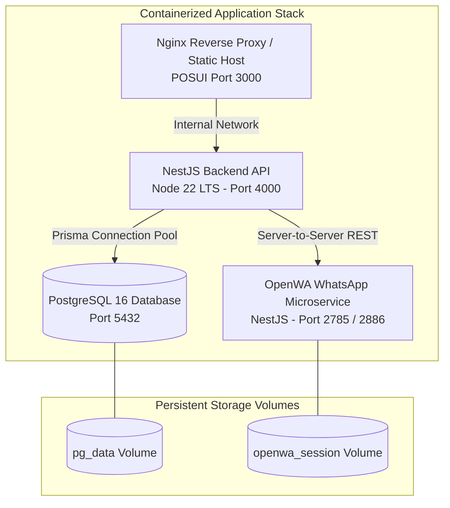

# Production Deployment & Hosting Architecture: POS & Billing System

## 1. Hosting Architecture Overview
The POS & Billing System is packaged as a multi-container architecture using Docker Compose for local/on-premise store deployments, and standard container orchestration (e.g., Docker Swarm, ECS, or Kubernetes) for cloud deployments.



---

## 2. Docker Compose Topology (`docker-compose.yml`)

The production/local stack defines four coordinated services:

### 2.1 Services Definition
1. **`postgres`:**
   - Image: `postgres:16-alpine`
   - Volume: `pg_data:/var/lib/postgresql/data`
   - Extensions: Preloaded with `pg_trgm`, `citext`, `pgcrypto`.
   - Healthcheck: `pg_isready -U postgres -d pos_billing_db`
2. **`backend`:**
   - Build: Multi-stage Dockerfile based on `node:22-alpine`.
   - Release Entrypoint: Runs `prisma migrate deploy` prior to launching `node dist/main.js`.
   - Depends On: `postgres` (condition: `service_healthy`).
   - Ports: Exposes `4000:4000`.
3. **`openwa`:**
   - Build: `OpenWA/` Dockerfile with Chromium dependencies.
   - Volume: `openwa_session:/app/auth_info_baileys` (CRITICAL: WhatsApp session tokens must persist across container restarts).
   - Ports: Exposes `2785:2785` (API) and `2886:2886` (Pairing UI).
4. **`posui`:**
   - Production multi-stage build: Vite production build (`dist/`) copied to an `nginx:alpine` container.
   - Ports: Exposes `3000:80`.

---

## 3. Database Migration Deployment Pipeline

### 3.1 Zero-Downtime Migration Policy
- **Additive First:** Schema changes in production must be backwards-compatible (e.g., add new nullable column first, deploy updated backend code, then apply NOT NULL constraint if necessary).
- **Never Edit Applied Migrations:** Existing migration files in `prisma/migrations` are strictly immutable once committed.
- **Automated Deployment:** CI/CD runners or release containers execute:
  ```bash
  npx prisma migrate deploy
  ```
  If any migration fails, the deployment aborts immediately, leaving the database in a predictable state.

### 3.2 Down-Path and Emergency Rollback
Every migration includes documented rollback SQL in `docs/DATABASE_SCHEMA.md`. In the event of an emergency release rollback:
1. Revert the application container image to the prior stable release tag.
2. Execute the corresponding down-path SQL script using a database administration console or release script.

---

## 4. Multi-Environment Staging Strategy

| Environment | Database Target | Backend API Host | WhatsApp Integration |
| :--- | :--- | :--- | :--- |
| **Development** | Local Docker Postgres (`:5432`) | `http://localhost:4000` | Local OpenWA with dummy SIM |
| **Staging** | Managed PostgreSQL (Stage RDS / Cloud SQL) | `https://api-stage.dailymart.in` | Dedicated Staging OpenWA gateway |
| **Production** | Managed PostgreSQL 16 (Multi-AZ, Daily PITR) | `https://api.dailymart.in` | Dedicated On-Premise Store Gateway |

---

## 5. Automated CI/CD Pipeline (GitHub Actions)
The automated workflow (`.github/workflows/ci.yml`) runs on every pull request to `main`:
1. **Lint & Formatting:** `npm run lint` across `backend` and `POSUI`.
2. **Typecheck:** `tsc --noEmit` in strict mode with 0 errors.
3. **Container Service Boot:** Starts a real `postgres:16` test container in GitHub Actions.
4. **Database Migration & Seed:** Executes `prisma migrate deploy` and `npm run seed`.
5. **Automated Test Suite:**
   - Unit tests (financial math with `decimal.js`).
   - Integration tests (Supertest against real database).
   - Concurrency tests (parallel invoice creation, FEFO last-unit race condition, idempotency retry).
6. **Frontend Build Check:** Validates `npm run build` in `POSUI` with zero warnings.
7. **Security Audit:** `npm audit --audit-level=high`.
