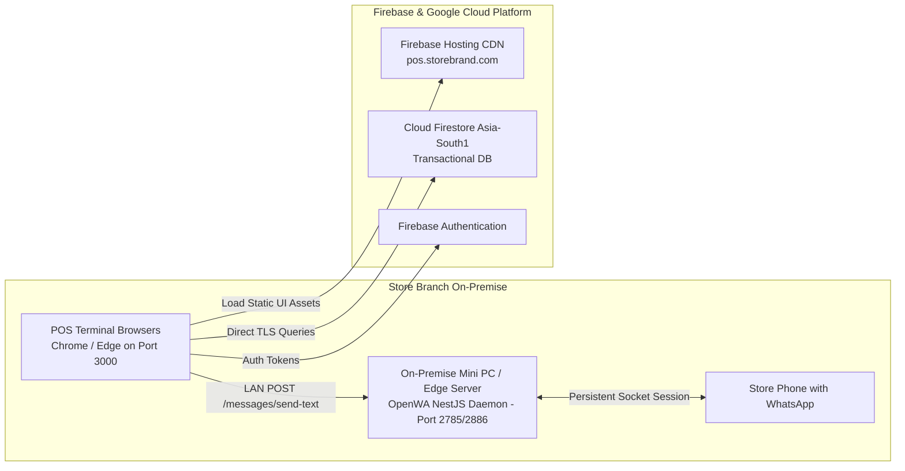

# Production Deployment & Hosting Architecture: POS & Billing System

## 1. Hosting Architecture
The POS & Billing System consists of two primary operational components requiring distinct hosting topologies:
1. **Frontend Single Page Application (`POSUI`):** Static assets built with React 18, hosted on **Firebase Hosting** with global CDN distribution and automated SSL termination.
2. **WhatsApp Gateway Microservice (`OpenWA`):** A persistent stateful Node.js (NestJS) process utilizing Chromium (Puppeteer) or raw WebSocket sockets (`@whiskeysockets/baileys`). It **MUST** run on a dedicated persistent server or on-premise store gateway machine to maintain an active WhatsApp session.



---

## 2. Multi-Environment Staging Strategy
To ensure total isolation of production billing data from staging, three separate Firebase projects are configured:

| Environment | Firebase Project ID | Purpose | URL / Access |
| :--- | :--- | :--- | :--- |
| **Development** | `pos-billing-dev` | Local development, unit testing, Firestore Emulator. | `http://localhost:3000` |
| **Staging** | `pos-billing-stage` | End-to-end integration testing, QA verification, mock OpenWA. | `https://stage-pos.web.app` |
| **Production** | `pos-billing-prod` | Live store operations, audited transactions, real receipts. | `https://pos.dailymart.in` |

---

## 3. Deployment Procedures

### 3.1 Security Rules & Composite Indexes Deployment
Rules and indexes must always be deployed **prior** to the front-end code release:
```bash
# 1. Authenticate with Firebase CLI
firebase login

# 2. Select the targeted project
firebase use pos-billing-prod

# 3. Deploy Firestore Security Rules
firebase deploy --only firestore:rules

# 4. Deploy Firestore Composite Indexes
firebase deploy --only firestore:indexes
```

### 3.2 Frontend Deployment (`POSUI`)
```bash
# In POSUI directory
npm install --legacy-peer-deps

# Build production bundle with legacy OpenSSL flag
$env:NODE_OPTIONS="--openssl-legacy-provider"
npm run build

# Deploy to Firebase Hosting
firebase deploy --only hosting
```

### 3.3 OpenWA Gateway Production Setup
Because OpenWA requires persistent file storage to preserve paired WhatsApp session tokens (`auth_info_baileys` folder), it must run as a managed system service using **PM2** or **Docker**:

```bash
# In OpenWA directory
npm install
npm run build

# Start daemon via PM2
pm2 start dist/main.js --name "openwa-gateway" --restart-delay=3000
pm2 save
pm2 startup
```

---

## 4. Rollback and Disaster Recovery Runbook
1. **Frontend Instant Rollback:**
   Firebase Hosting allows 1-click zero-downtime rollbacks via CLI or Console:
   ```bash
   firebase hosting:channel:deploy previous_version
   ```
2. **Security Rules Reversion:** Maintain `firestore.rules` under strict Git version control. Re-deploy the previously tagged stable ruleset immediately if permission conflicts occur.
3. **OpenWA Session Recovery:** If the WhatsApp session drops or gets logged out, the store manager navigates to `http://localhost:2886`, generates a fresh QR code, and re-scans via the store smartphone.
