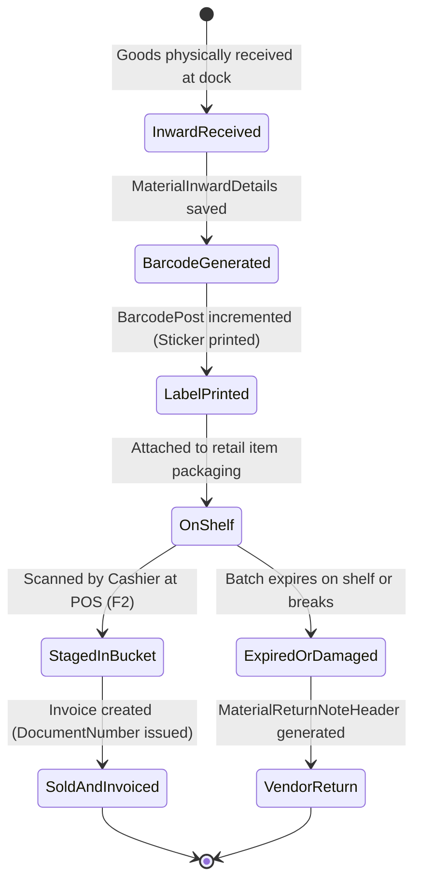

# Inventory Rules & Stock Lifecycle Specification: POS & Billing System

## 1. Stock Inflow & Outflow Architecture
Inventory balance is governed by three primary transactional drivers:
1. **Stock In (+):** Recorded via `MaterialInwardDetails` upon receipt of goods from vendors (against PO or ad-hoc).
2. **Stock Out (-):** Recorded via `InvoiceDetails` when customer sales are finalized.
3. **Vendor Returns (-):** Recorded via `MaterialReturnNoteDetails` when damaged or expired goods are shipped back to suppliers.

---

## 2. The Stock Derivation Decision (Resolution to GAP-01)

### 2.1 The Architectural Problem
Deriving stock-on-hand on the fly by scanning and aggregating all historical `MaterialInwardDetails`, subtracting all historical `InvoiceDetails`, and subtracting all `MaterialReturnNoteDetails` introduces massive performance bottlenecks. In a retail store with 50,000 monthly line items, a single catalog view would consume tens of thousands of Firestore reads, triggering severe quota exhaustion and query latency.

### 2.2 Adopted Architecture: Transactional Stock Counter
To maintain sub-100ms POS response times while keeping Firestore costs minimal:
- Introduce a lightweight tracking collection: `/ProductStock/{storeId_productId}`
- Schema:
  - `StoreId` (string)
  - `ProductId` (string)
  - `QuantityOnHand` (number)
  - `LastUpdated` (timestamp)
- **Mutation Hooks:**
  - Upon committing `MaterialInwardDetails`: `QuantityOnHand` increments by `+Qty`.
  - Upon committing `InvoiceDetails` inside the checkout transaction: `QuantityOnHand` decrements by `-Qty`.
  - Upon committing `MaterialReturnNoteDetails`: `QuantityOnHand` decrements by `-Qty`.
  - Upon an Admin soft-cancelling an invoice: `QuantityOnHand` increments back by `+Qty`.

---

## 3. Batch Expiry & FEFO (First-Expiry-First-Out)
- **Shelf Life Calculation:** For products marked `IsExpDate = true`, the system sets:
  $$\text{ExpiryDate} = \text{InwardDate} + (\text{ShelfLifeDays} \times 86400000\text{ ms})$$
- **FEFO Enforcement at POS:** When multiple inward batches exist for an item:
  - The POS barcode system prints batch-specific barcodes containing batch IDs.
  - Cashiers are trained to scan shelf stickers. If a cashier scans a batch with a later expiry date while an earlier batch of the same SKU remains unsold, an ambient amber prompt suggests: "Earlier batch available on shelf".
- **Hard Expiry Block:** If `Batch.ExpiryDate < Today`, the item cannot be added to any bucket under any circumstance.

---

## 4. Negative Stock Policy
- **Retail Real-World Reality:** In fast-moving grocery environments, physical stock may arrive on shelves before the formal invoice is entered by the receiving clerk.
- **System Policy:** The POS terminal allows checkout even if the derived `QuantityOnHand <= 0` (preventing cashier lockout during peak rushes), but flags the line item with an amber alert "Negative Stock Recorded".
- **Reconciliation:** A daily negative stock exception report alerts the Inventory Manager to enter missing Material Inward dockets.

---

## 5. Barcode Lifecycle & Generation



### Barcode Encoding Format
The barcode string generated in `MaterialInwardBarcodes.Barcode` follows a standardized 13-character Code-128 / EAN format:
```text
[Prefix: 2] [StoreId: 2] [ProductId: 5] [BatchSequence: 4]
Example: "20" + "01" + "00102" + "0045" -> "2001001020045"
```
- Compatible with all standard 1D laser and 2D image scanners operating in USB HID Keyboard-Wedge mode.
