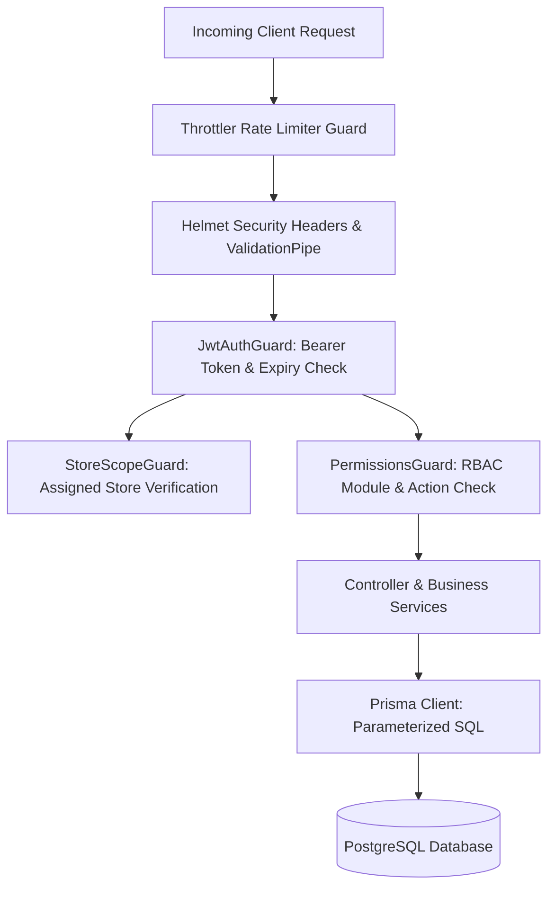

# Security Architecture & Rules Specification: POS & Billing System

## 1. Threat Model & Security Posture
With the introduction of the dedicated NestJS backend, **all security and authorization boundaries are enforced exclusively on the server**. Client-side route guards and disabled UI components serve strictly as user-experience conveniences.



---

## 2. Authentication Security

### 2.1 Password Hashing & Storage
- Passwords are encrypted using **`argon2id`** (memory cost 65536 KiB, time cost 3, parallelism 4).
- Raw passwords and weak hashes (MD5, SHA-1, plain bcrypt) are strictly prohibited.

### 2.2 Account Lockout & Brute-Force Defense
- **Failed Login Threshold:** 5 consecutive failed login attempts locks the account for **15 minutes**.
- **User Enumeration Prevention:** Error messages for invalid credentials are completely generic: `"Invalid email or password"`. The system returns identical response timing and status codes whether an email exists or not.
- Rate limiting on `/auth/login` and `/auth/refresh` is enforced strictly at **5 requests per minute per IP**.

### 2.3 JWT Lifecycle & Refresh Token Rotation
- **Access Tokens:** Signed with `JWT_ACCESS_SECRET` (minimum 32 random bytes), 15-minute expiration time. Contains payload: `{ sub: userId, role: roleName, stores: [storeId] }`.
- **Refresh Tokens:** Signed with a separate `JWT_REFRESH_SECRET`, 7-day expiration time.
  - Stored in an **`httpOnly; Secure; SameSite=Lax`** cookie to block Cross-Site Scripting (XSS) extraction.
  - Stored in the database as an irreversible **SHA-256 hash** (`token_hash`).
  - **Automatic Rotation & Reuse Detection:** Every invocation of `POST /auth/refresh` immediately invalidates the old refresh token and issues a new one. If an invalidated refresh token is ever presented (indicating token theft), **the entire family of tokens for that user is instantly revoked**, forcing re-authentication.

### 2.4 Google OAuth Verification
- The frontend obtains an ID token via Google Identity Services and sends it to `POST /auth/google`.
- The backend verifies token signature, audience (`GOOGLE_CLIENT_ID`), issuer, and expiry using `google-auth-library`.
- Matching occurs on `google_sub` or a verified email associated with a **pre-created staff user**.
- **Zero Self-Escalation:** Unknown Google accounts are never granted staff roles; they are rejected with 403 unless `ALLOW_SELF_SIGNUP=true` is explicitly enabled in store settings.

---

## 3. Role-Based Access Control (RBAC) & Authorization

### 3.1 Role Hierarchy & Deny-by-Default Guard
Only three authenticated roles exist:
1. **`ADMIN`:** Unrestricted administrative, financial, and user management authority.
2. **`CASHIER`:** Restricted to checkout, customer registration, own invoice history, and product browsing.
3. **`INVENTORY_MANAGER`:** Restricted to supply chain, inward, purchasing, returns, stock batches, and expiry reports.
- **External Vendors:** Vendors have **no user credentials or system access**.

### 3.2 Granular Permissions Matrix
Enforced on endpoints using the custom `@RequirePermission(module, action)` decorator:
```typescript
@UseGuards(JwtAuthGuard, PermissionsGuard, StoreScopeGuard)
@RequirePermission('INVOICES', 'APPROVE')
@Post(':id/cancel')
async cancelInvoice(...) { ... }
```
- **Deny-by-Default:** Any endpoint lacking an explicit permission decorator is automatically rejected by the global `PermissionsGuard`.
- **Store-Scoping:** `StoreScopeGuard` verifies that the `store_id` targeted in the request exists in the user's assigned store permissions (`user_stores`), preventing cross-branch data tampering.

---

## 4. API & Application Hardening

### 4.1 Security Headers (`helmet`)
- Enforces HTTP Strict Transport Security (`HSTS`), `X-Frame-Options: DENY`, `X-Content-Type-Options: nosniff`, and Content Security Policy (`CSP`).

### 4.2 Cross-Origin Resource Sharing (CORS)
- Strict origin matching against `CORS_ORIGINS` (e.g., `http://localhost:3000`).
- Wildcards (`*`) are prohibited; `credentials: true` is strictly enforced.

### 4.3 DTO Validation & Injection Defense
- NestJS global `ValidationPipe` with:
  ```typescript
  new ValidationPipe({
    whitelist: true,
    forbidNonWhitelisted: true,
    transform: true
  })
  ```
- Strips any extraneous properties injected by malicious clients.
- Rejects unexpected fields with HTTP 400.
- All database queries are executed via Prisma's parameterized engine or prepared raw SQL queries. String concatenation in queries is strictly prohibited.

---

## 5. Privacy, Logging & Audit Trail

### 5.1 Structured Logging & PII Redaction (`nestjs-pino`)
- All server logs are formatted as structured JSON.
- **PII Redaction Rules:** Customer mobile numbers, customer emails, passwords, bearer tokens, and PAN/Aadhaar/GST numbers are automatically redacted with `[REDACTED]` tokens prior to writing to disk.

### 5.2 Immutable Audit Logs (`audit_logs`)
The backend automatically inserts an immutable `audit_logs` record for all sensitive actions:
- Authentication events (`LOGIN`, `LOGOUT`, `FAILED_LOGIN`, `LOCKOUT`).
- Financial operations (`INVOICE_CREATE`, `INVOICE_CANCEL`).
- Inventory mutations (`STOCK_ADJUSTMENT`, `MATERIAL_RETURN`).
- User governance (`ROLE_CHANGE`, `USER_CREATE`, `USER_DEACTIVATE`).

### 5.3 Database Least Privilege
- In production, the backend database user has permissions restricted to `SELECT`, `INSERT`, `UPDATE`, `DELETE` on public tables.
- Table creation, alteration, and dropping (`DDL`) permissions are held by a separate migration deployment role.
