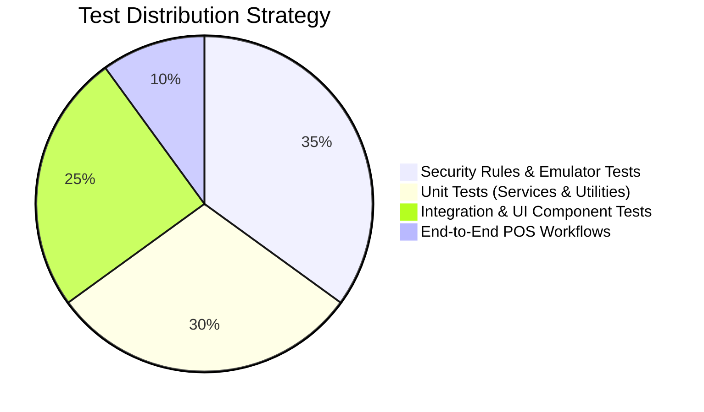

# Quality Assurance & Testing Strategy Specification: POS & Billing System

## 1. Testing Pyramid & Methodology
The testing architecture balances rapid developer feedback with strict security and financial correctness guarantees.

---

## 2. Testing Levels & Tooling

### 2.1 Unit Tests (Jest & React Testing Library)
- **Scope:**
  - Pure calculation functions (`calculateGst`, `roundOffCurrency`, `formatIndianCurrency`).
  - Formik + Yup schema validations (GSTIN regex, shelf life validation, required phone formats).
  - Redux slice reducers (`cartSlice`, `heldBucketsSlice`).
- **Tooling:** `jest`, `@testing-library/react`, `@testing-library/user-event`.

### 2.2 Firestore Emulator Suite & Security Rules Tests
Because security lives directly in `firestore.rules`, all security assertions are validated against the **Firebase Emulator Suite** (`@firebase/rules-unit-testing`):
- **Assertions Tested:**
  - Cashiers cannot read vendor or purchase order documents.
  - Inventory Managers cannot read invoices or customer details.
  - Finalized invoices cannot have their rates, tax, or amounts altered by any role.
  - Unauthenticated requests are rejected across all paths.
  - Hard deletions return permission-denied.

### 2.3 UI & Component Integration Tests
- Validates Mantis components, tables, filters, and modals.
- Verifies loading skeleton display, empty state illustrations, and error banners.
- Tests keyboard event listeners (`F2`, `F8`, `F9`) in the POS terminal component.

### 2.4 End-to-End (E2E) Flow Tests (Cypress / Playwright)
- **Primary Scenarios:**
  1. Login -> Open Terminal -> Scan Barcode -> Add Customer -> Tender Cash -> Generate Invoice -> Verify PDF.
  2. Create PO -> Process Material Inward -> Verify Generated Barcodes.
  3. Admin Invoice Soft-Cancellation -> Verify CANCELLED watermark and reason.

---

## 3. Performance & Accessibility Testing
- **Lighthouse CI:** Integrated into GitHub Actions; enforces minimum score of `90` on Accessibility, Best Practices, and Performance.
- **Axe-Core:** Automated ARIA checks ensuring no missing `aria-label` or contrast violations.

---

## 4. Continuous Integration (CI) Pipeline
- **Triggers:** Pull requests to `main` and `develop`.
- **Pipeline Stages:**
  1. `Lint & Formatting`: ESLint and Prettier checks.
  2. `Security Rules Unit Tests`: Spawns Firebase Emulator in Docker, executes `@firebase/rules-unit-testing`.
  3. `Frontend Unit Tests`: Jest test run with code coverage report (minimum 80% branch coverage required for financial math utilities).
  4. `Production Build Check`: Validates Webpack build with legacy OpenSSL flag.
