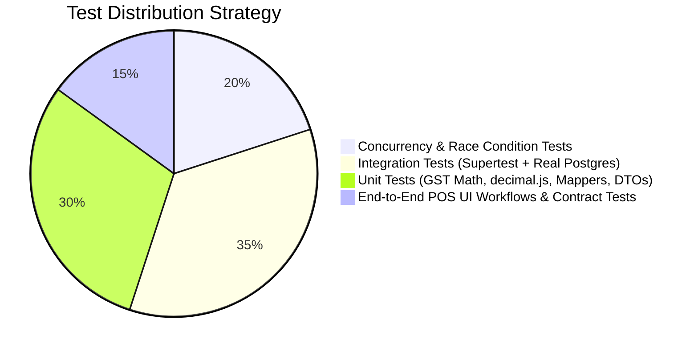

# Quality Assurance & Testing Strategy Specification: POS & Billing System

## 1. Testing Pyramid & Principles
The testing framework guarantees strict correctness across financial math, concurrency control, and inventory integrity. **The database is never mocked in integration or concurrency tests**; all tests execute against a real PostgreSQL 16 container.

---

## 2. Test Suites & Methodologies

### 2.1 Unit Tests (Jest)
- **Scope:**
  - Financial calculations (`decimal.js`): GST intra-state 50/50 splits, inter-state IGST, tax-inclusive reverse calculations, round-off rounding logic.
  - DTO validation pipes (`class-validator`): checking regex for GSTIN, positive quantity limits, mandatory shelf-life days when `is_exp_date = true`.
  - Frontend bidirectional mappers (`src/_api/mappers/*`): verifying lossless round-trip transformations between backend `camelCase` and legacy `PascalCase`.
- **Target:** 100% branch coverage on financial arithmetic and tax calculation utilities.

### 2.2 Integration Tests (Supertest + Real PostgreSQL)
- **Scope:**
  - Master data CRUD and soft-deletion behavior.
  - Authentication flows: argon2id password verification, lockout after 5 failed logins, JWT refresh rotation, token reuse detection revoking token family.
  - Granular RBAC enforcement: scanning all registered endpoints to assert 401 without Bearer token and 403 when role lacks the module/action permission.
  - Material inward processing creating `stock_batches` with unique thermal barcodes and `INWARD` ledger entries.
  - Invoice soft-cancellation reversing batch stock and refunding payment.

### 2.3 Concurrency & Race Condition Tests
These tests validate mission-critical transactional guarantees under high-concurrency store rush conditions:
1. **Parallel Invoice Numbering (Gapless Guarantee):**
   - 50 simultaneous checkouts executed in parallel for a single store.
   - **Assertion:** 50 unique, gapless, sequential numbers generated (e.g., `000101` to `000150`) with zero deadlocks and zero duplicate key conflicts.
2. **FEFO Stock Race Condition (Last Unit Check):**
   - Two cashiers simultaneously checkout the final 1 available unit of an item.
   - **Assertion:** Exactly one checkout succeeds (HTTP 201); the other is rejected with HTTP 409 `STOCK_INSUFFICIENT`.
3. **Idempotency Protection:**
   - 10 parallel requests dispatched with the exact same `Idempotency-Key` UUID.
   - **Assertion:** Exactly 1 invoice is inserted; all 10 calls receive identical HTTP 200/201 responses with the same document number.
4. **Inventory Ledger Invariant Test:**
   - Executed after complex multi-step workflows (inward, sales, cancellations, returns).
   - **Invariant:** `SUM(stock_ledger.quantity_delta) == SUM(stock_batches.quantity_available)` for every SKU and store.

### 2.4 API Contract Verification Tests
- Generates OpenAPI schema via `@nestjs/swagger` into `docs/openapi.json`.
- Automated test verifies that every function in `POSUI/src/_api/*` maps to an existing endpoint, matching HTTP method, path, request parameters, and response attributes.

---

## 3. Code Coverage & Quality Thresholds
Every pull request must satisfy these minimum quality gates:
- Minimum **80% line and branch coverage** across `invoices`, `stock`, `auth`, and `common/utils`.
- `tsc --noEmit` exits with **0 errors** in TypeScript strict mode.
- ESLint exits with **0 errors and 0 warnings**.
- Zero usage of `any` type in application TypeScript code.
- Zero raw `console.log` statements (structured `pino` logger used exclusively).
