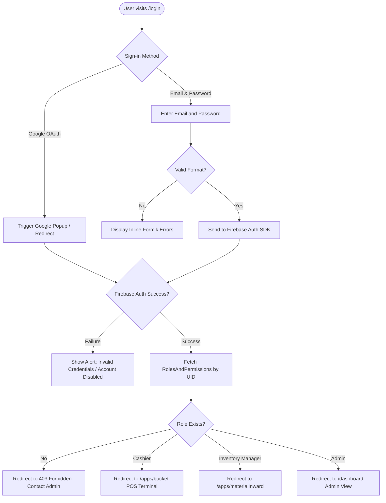
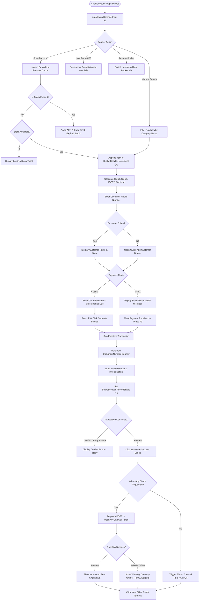
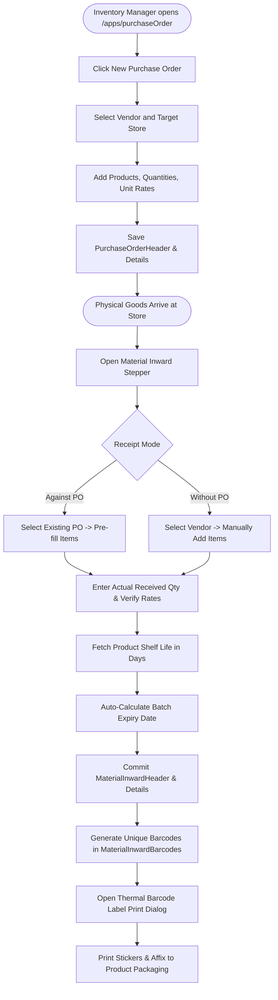
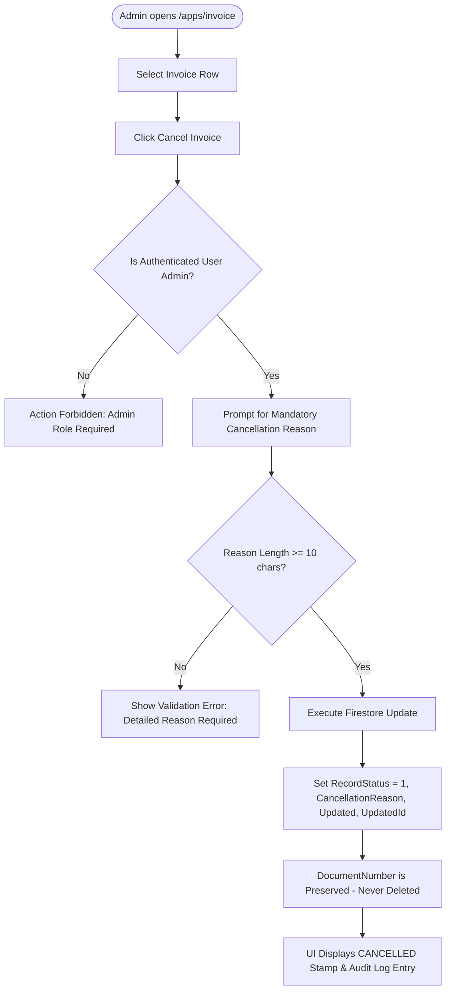
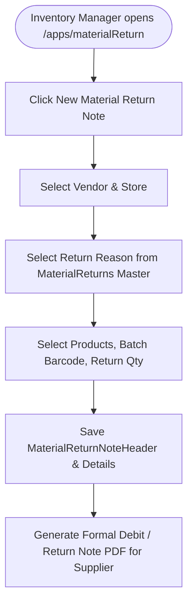

# User Flows Specification & Diagrams: POS & Billing System

## 1. Authentication Flow (Google OAuth & Email/Password)

---

## 2. POS Terminal Billing Flow (Bucket to Finalized Invoice)

---

## 3. Procurement, Material Inward & Barcoding Flow

---

## 4. Invoice Cancellation Flow

---

## 5. Vendor Material Return Flow

